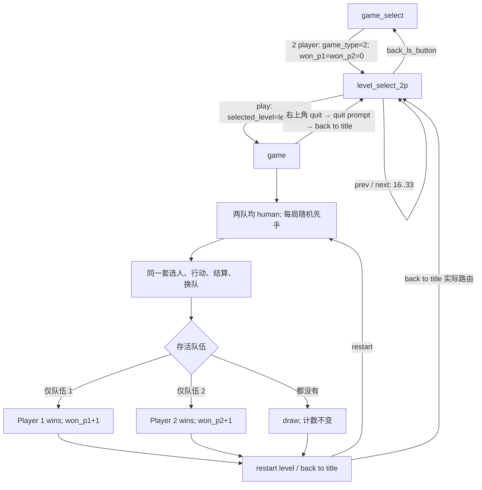

# 01.05 · 双人模式：原版行为规格

基线：2026-09-25，本地 `mutiny.swf`（见 [导出元数据](../../10-OriginalEvidence/Artifacts/ReverseEngineering/Swf/metadata.json)）及 [原站 16–33 关 XML](../../10-OriginalEvidence/Artifacts/TwoPlayerLevels/README.md)。原版规则来自 AS2、pcode、SWF 时间轴和原站资源；Unity 验证结果单独列出。实施顺序与剩余验收见 [PLAN.md](PLAN.md)。这里的“双人”是同一设备、同一指针轮流操作的本地对战：这是 `Team` 的人类控制分支和 `TileSystem.mouseDown/mouseUp` 的单指针入口共同支持的静态结论，输入手感仍须运行观察。

## 原版状态与数据流

`back to title` 是原版按钮的资源名；其 `QuitGameButton` 处理器在双人模式实际返回 `level_select_2p`，因此图中按真实路由记载。重新点击模式页的 `2 player` 才把本次对战的胜局计数清零。

## 证据索引

以下路径均指本仓库保存的原版导出物，不以当前 C# 行为推断原版规则。

| 证据 | 原版来源与核对点 |
| --- | --- |
| E01 | [TwoPlayerButton.as](../../10-OriginalEvidence/Artifacts/ReverseEngineering/Swf/deobfuscated/scripts/__Packages/com/nitrome/buttons/TwoPlayerButton.as) 9–15；[对应 pcode](../../10-OriginalEvidence/Artifacts/ReverseEngineering/Swf/pcode/scripts/__Packages/com/nitrome/buttons/TwoPlayerButton.pcode) 217–235：模式=2、两计数清零、进入双人选关 |
| E02 | [LevelSelect2p.as](../../10-OriginalEvidence/Artifacts/ReverseEngineering/Swf/deobfuscated/scripts/__Packages/com/nitrome/buttons/LevelSelect2p.as) 9–11、20–100：范围、回到选关时的编号、三按钮、边界可见性、开战 |
| E03 | [根帧 2](../../10-OriginalEvidence/Artifacts/ReverseEngineering/Swf/deobfuscated/scripts/frame_2/DoAction.as) 141–151：注册 33 关、启动时将 16–33 设为已解锁；[根帧 111](../../10-OriginalEvidence/Artifacts/ReverseEngineering/Swf/deobfuscated/scripts/frame_111/DoAction.as) 3–6：双人选关页显示 `won_p1/won_p2` |
| E04 | [Team.as](../../10-OriginalEvidence/Artifacts/ReverseEngineering/Swf/deobfuscated/scripts/__Packages/com/nitrome/throwgame/Team.as) 14–25、201–324：仅单人模式的二队由 AI 控制；共用回合/队伍逻辑，提示“Player N, take your turn” |
| E05 | [Controller.as](../../10-OriginalEvidence/Artifacts/ReverseEngineering/Swf/deobfuscated/scripts/__Packages/com/nitrome/throwgame/Controller.as) 36–86、136–195、200–241：菜单模式与 raw XML 特例、随机先手、换队、三种结算及胜局计数 |
| E06 | [TileSystem.as](../../10-OriginalEvidence/Artifacts/ReverseEngineering/Swf/deobfuscated/scripts/__Packages/com/nitrome/throwgame/TileSystem.as) 127–201、613–765：红队/其他角色归属、双人无单人开场对白、当前队选人和同一鼠标入口；天色编号段 |
| E07 | [QuitGameButton.as](../../10-OriginalEvidence/Artifacts/ReverseEngineering/Swf/deobfuscated/scripts/__Packages/com/nitrome/buttons/QuitGameButton.as) 9–24、[RestartLevelButton.as](../../10-OriginalEvidence/Artifacts/ReverseEngineering/Swf/deobfuscated/scripts/__Packages/com/nitrome/buttons/RestartLevelButton.as) 9–18、[BackButton.as](../../10-OriginalEvidence/Artifacts/ReverseEngineering/Swf/deobfuscated/scripts/__Packages/com/nitrome/buttons/BackButton.as) 10–20：返回、重开和选关返回路径 |
| E08 | [IngamePopup.as](../../10-OriginalEvidence/Artifacts/ReverseEngineering/Swf/deobfuscated/scripts/__Packages/com/nitrome/game/IngamePopup.as) 8–29；[popup 帧标签](../../10-OriginalEvidence/Artifacts/ReverseEngineering/Art/frame-labels.csv) 18–20；[SWF XML](../../10-OriginalEvidence/Artifacts/ReverseEngineering/Swf/mutiny.swf.xml) 中 sprite 342 的 41/51/61 帧：标题、淡入淡出和独立按钮；[双人选关 sprite 629](../../10-OriginalEvidence/Artifacts/ReverseEngineering/Art/raster/sprites/DefineSprite_629_level_select_2p/1.png) 仅供核对静态画面 |
| E09 | [sprite 628 的 18 个逐帧文字脚本](../../10-OriginalEvidence/Artifacts/ReverseEngineering/Swf/deobfuscated/scripts/DefineSprite_628)、[原站 XML 清单](../../10-OriginalEvidence/Artifacts/TwoPlayerLevels/catalog.csv)、[NitromeGame.as](../../10-OriginalEvidence/Artifacts/ReverseEngineering/Swf/deobfuscated/scripts/__Packages/NitromeGame.as) 78–84：双人关卡名称、编号哈希映射、原件 SHA-256 与 `players` 原值 |

## 行为规则与验收口径

| 稳定 ID | 可观察行为及状态转换 | 原版来源 | Unity 入口（拟接入/现有） | 验收用例 | 当前实际结果 |
| --- | --- | --- | --- | --- | --- |
| 2P-NAV-01 | 模式页按 `2 player`：设双人模式，胜局 0:0，进入双人选关；从双人选关按 Back 返回模式页，再次进入又清零 | E01、E07 | `MutinyFrontendFlow`、`MutinyFrontendController` | 驱动真实前端按钮和返回路径；检查模式、页面、胜局显示 | 已实现；Flow 状态自动断言通过，实际按钮点击和比分画面待 Play Mode |
| 2P-SEL-01 | 双人选关默认 16；若上次 `selected_level>=16` 则沿用。Prev/Next 在 16/33 边界分别隐藏；中央预览、关卡名随 18 个帧变化，Play 将当前编号带入战斗 | E02、E03、E08、E09 | `MutinyFrontendFlow`、`MutinyFrontendController` | 逐步遍历 16–33，核对编号、图像、名称、按钮可见与命中、悬停/按下、边界及重返时记忆 | 已实现；Flow 遍历/记忆及第 33 关可选自动断言通过；图像、悬停、命中与 Play 点击待运行 |
| 2P-SEL-02 | 原版双人 16–33 在启动时全部解锁；双人选关不调用单人解锁门，选关不重置单人分数 | E02、E03；对照 [LevelSelectButton.as](../../10-OriginalEvidence/Artifacts/ReverseEngineering/Swf/deobfuscated/scripts/__Packages/com/nitrome/buttons/LevelSelectButton.as) 20–63 | `MutinySaveSystem`、`MutinyFrontendFlow` | 新存档直接选择双人任一已取得资源关卡；单人解锁和分数不被双人流程改写 | 已实现；第 33 关通过选择门，双人结算前后单人解锁/分数自动断言通过；全 18 关逐关选择待运行 |
| 2P-DATA-01 | 菜单进入编号关卡时 `game_type=2` 保持为玩法模式；仅 `Controller.startGame(raw)` 的 raw XML 特例从 `players` 覆盖模式。按 XML 类型把红海盗给队伍 1，其余已识别角色给队伍 2 | E05、E06 | `MutinyLevelController`、`MutinyLevelXmlParser`、`MutinyLevelBuilder` | 以菜单选择带 `players=1` 的候选关卡，仍核对两队人类控制；另测 raw XML 特例 | 已实现；生产编号加载 16–33 均生成两支人类队伍，16 的 `players=1` 保持原值；raw 特例完整流程待运行 |
| 2P-TURN-01 | 每次 `startGame/changeLevel` 两队都非 AI 时各有 50% 先手机会；之后沿用共用回合结算并在两队间交替 | E04、E05 | `MutinyTurnManager`、`MutinyTeam` | 从生产加载入口记录多次先手；分别让红、蓝行动完成并核对切换，不以测试手改队伍布尔量代替 | 已接入；自动回合/输入断言仅在 Play Mode 执行，尚未登记通过；先手分布和完整行动待测 |
| 2P-INP-01 | 当前队只能从本队角色中选；两个人轮流使用同一鼠标选人、拖放和武器入口，非当前队不能发起行动 | E04、E06 | `MutinyPlayerInput`、`MutinyTurnManager`、`MutinyGameHUD` | 在两队实际回合点击本队/对手角色及武器面板；验证资格、操作结果、红蓝状态图与镜头 | 已接入；自动资格断言待 Play Mode；实际拖放、武器、状态图与镜头未验收 |
| 2P-FEED-01 | 回合提示为 `Player 1/2, take your turn`；武器面板随队伍切红/蓝；双人进入关卡不触发单人 AI 开场对白 | E04、E06 | `MutinyIngameTextArea`、`MutinyGameHUD`、`MutinySpeechController` | 两队开局/换队逐帧核对提示、面板可见和状态，确认无 AI 台词 | 已实现；提示队列断言待 Play Mode；面板画面/对白待人工验收 |
| 2P-END-01 | 任一队全灭时按存活情况显示 `Player 1 wins`、`Player 2 wins` 或 `draw`；仅胜者计数 +1，平局两计数不变。双人分支不走单人得分/解锁 | E05、E08 | `MutinyTurnManager`、`MutinyGameHUD`、`MutinyLevelController` | 生产伤害/落水分别造成三种结果；核对弹窗、计数一次、单人进度无变化 | 已实现；生产落水/回合结算三结果与计数去重自动断言通过；实际弹窗画面待运行 |
| 2P-END-02 | 对战弹窗沿用 sprite 342 面板，但 41/51/61 帧各有独立标题，`restart level` 与 `back to title` 是独立子按钮，弹窗每帧 Alpha ±25；不可把整张导出 PNG 当全部状态 | E07、E08 | `MutinyGameHUD`、`MutinyTransitionManager` | 分别检查三种标题、两按钮的显示/资格/点击/hover/命中区域与 25 FPS 动画时序 | 已接入独立结果状态和按钮绘制；三种路由自动断言通过，画面、命中和动画时序待 Play Mode |
| 2P-EXIT-01 | 对战弹窗 Restart 重载同一关并重新抽先手，胜局计数保留；弹窗或右上角 Quit 的 `back to title` 实际回双人选关并保留计数与关卡编号 | E02、E05、E07、E08 | `MutinyLevelController`、`MutinyFrontendController`、`MutinyGameHUD` | 先制造 1:0，再重开、退出、重新进关；核对 1:0、编号和先手；重进模式页才清零 | 已实现；生产 Restart 保留 1:0/编号自动断言通过；Quit/弹窗实际按钮和重抽先手待运行 |
| 2P-ASSET-01 | 16–33 共 18 个双人选关帧；原版按 `MD5("yoho"+编号)+.xml` 加载对应编号，天色分段 16–21/22–27/28–33 | E02、E03、E06、E09 | `MutinyLevelController`、`MutinyOriginalBackground`、资源目录 | 为每个编号建立来源哈希、XML、缩略/名称和天色映射，再逐关加载核对 | 原站 18 XML、SHA 和编号映射静态核验；Unity 生产入口逐关加载 16–33、双队存活/人类与天色 18 项自动断言通过；画面对照待测 |

## 关卡帧与资源边界

原版双人选关的 `content_clip.gotoAndStop(level_id-15)` 将 16–33 映射到 sprite 628 的 1–18 帧；文字来自各帧的动态 DangleFont 构造脚本。名称依编号依次为：

| 原版编号 | 名称 | 原版编号 | 名称 | 原版编号 | 名称 |
| --- | --- | --- | --- | --- | --- |
| 16 | the docks | 22 | boulder dash | 28 | flatlands |
| 17 | island hopping | 23 | marooned | 29 | skull island |
| 18 | about turn | 24 | tower of terror | 30 | stepping stones |
| 19 | battleships | 25 | the galleon | 31 | death bowl |
| 20 | boom boom beach | 26 | mountain madness | 32 | mega beach |
| 21 | king of the hill | 27 | one on one | 33 | blast caverns |

早期本地来源 `Mutiny Source/mutiny-flash-game/mutiny_levels/level_01.xml` 至 `level_18.xml` 仅 18 份，扫描均为 `players=1`。2026-09-25 根据原版哈希命名规则取得并归档原站 16–33 全部 18 份 XML；原有 16–18 的 SHA-256 与原站对应文件完全一致，编号映射因此确认。新取得的 19–33 原件按编号逐字节复制到 Unity 的 `Resources/Data/Levels/` 及编辑源 `Data/Levels/`。逐关来源、`players` 与 SHA 见 [清单](../../10-OriginalEvidence/Artifacts/TwoPlayerLevels/catalog.csv)。

## 本轮状态

- **静态确认**：AS2、pcode、时间轴及原站 16–33 XML；每关原件 SHA-256、编号、`players` 见证据清单。
- **已实现**：双人前端/会话/结算路径及 16–33 编号加载；本次补齐 19–33 的原版 XML，修复选关显示 `data unavailable` 的资源缺口。
- **实际测试通过**：2026-09-25，Unity 6000.6.0f1 主工程编辑器菜单 `Mutiny → Parity → Validate Two Player Mode` 通过 **52/52** 断言，其中 16–33 的 `TryLoadLevel` 逐关生产加载均通过；`Assembly-CSharp-Editor.csproj` 编译通过。此菜单运行在编辑器态，`Application.isPlaying` 专属回合/输入断言未执行。
- **待运行验证**：Play Mode 的实际前端点击、双人操作、三种弹窗、Quit/Restart 交互、时序和逐关原版画面对照。
- **已知差异**：当前可证明资源可加载；原版运行实录与完整双人端到端画面验收尚未完成。详见 [计划](PLAN.md)。
