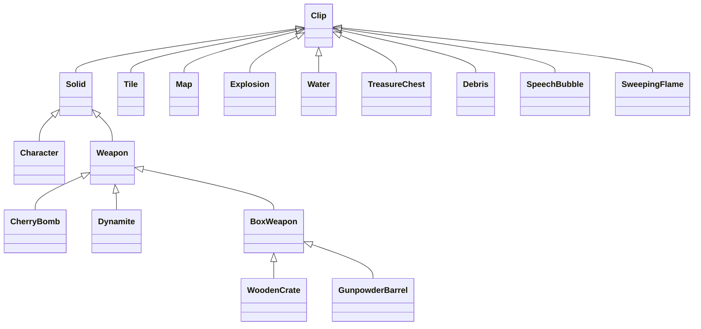

# AS2 类树与索引

2026-09-15 建立，输入为 `../Swf/deobfuscated/scripts/`，未执行 ActionScript。

当前完成的是结构索引与关键流程分析。具体运动、碰撞、武器及 AI 仍需逐项结合字节码和原版运行结果验证。

## 阅读入口

- [class-tree.md](class-tree.md)：完整 99 类继承树，标注外部父类 MovieClip、Object。
- [game-flow.md](game-flow.md)：关卡加载、逐帧更新、回合、武器及动画触发流程。
- [classes.csv](classes.csv)：完整类名、包、父类与源码位置。
- [methods.csv](methods.csv)：688 个方法与 get/set 访问器，含参数、静态标记、构造函数标记与行号。
- [fields.csv](fields.csv)：932 个类级字段声明。包含反编译器输出的继承字段重复声明，不代表全部独立存储字段。
- [references.csv](references.csv)：764 处跨类显式引用，区分构造、继承、限定调用、转换及其他引用。
- [event-bindings.csv](event-bindings.csv)：28 处指定 Flash 事件的显式赋值位置。
- [symbol-registrations.csv](symbol-registrations.csv)：59 处 Object.registerClass 注册，记录 SWF 链接名与类。
- [timeline-scripts.csv](timeline-scripts.csv)：395 个非类脚本，区分主时间轴、Sprite 时间轴、按钮及链接符号。
- [index-summary.json](index-summary.json)：生成数量及分析边界。

## 复现

在 Unity 工程根目录运行：

```powershell
python Tools/ReverseEngineering/build_class_index.py
```

索引按路径与名称固定排序，每次覆盖生成文件。人工维护的本 README 和 game-flow.md 不会被覆盖。

## 游戏核心继承关系



其余 Weapon 子类包括 Anchor、Banana、Boulder、Cannon、Cannonball、Mine、ParachuteBomb、PiecesOfEight、RumBottle、Seagull、TidalWave、VoodooDoll。SweepingFlame、TreasureChest 不继承 Weapon，需要单独保留更新与生命周期。

Controller、Team、TileSystem 是独立类，互相引用形成游戏运行结构；Controller 主要以静态字段持有全局状态。

`com.nitrome.throwgame` 共 31 类。其余包主要承担菜单、UI、音乐音效、排行榜与工具功能，mx 框架类属于 Flash UI 支撑，不宜逐个翻译为 Unity 类。

## 索引的准确性边界

生成器剔除字符串和注释再识别声明、引用与括号深度，包含 get/set 访问器并检查继承树覆盖全部类。每项提供源文件和行号，便于核对。

references.csv 是词法引用索引，不是完整调用图：不会自动解析 `this.equippedWeapon.advance()`、`cl.hit()`、回调或 `_root` 上的方法的运行时类型。同一个源码行可能产生多个引用；类转换与全局调用也可能需要人工区分。事件索引只覆盖脚本中指定事件的赋值，不替代时间轴及注册类的 onLoad 等声明。

去混淆结果仍可能存在语义错误。TreasureChest.dropNew 的循环出现不可达递增与异常 continue，不能照抄。game-flow.md 单独列出这类待验证点。

## 下一步

TODO 05：导出 SWF 美术资源，保留符号 ID、链接名、动画帧、尺寸和枢轴信息。随后使用 XML 标记清单与 SWF 链接表建立 Sprite 映射；不要将 antichest 强制映射为可见资源。
