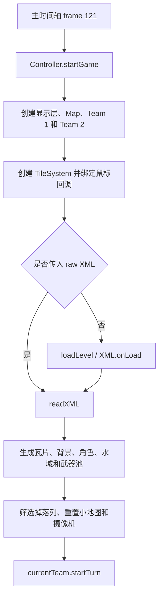
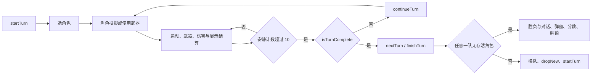

# Mutiny 原版关键流程

以下结论来自去混淆 AS 的静态阅读。表中行号指当前保存的脚本版本；源码位于 `../Swf/deobfuscated/scripts/`。实际游戏行为还需原版运行对照。爆炸第 3 帧调用另用 pcodehex 核对。

## 关键类职责

| 类 | 职责与重要入口 | 源码 |
| --- | --- | --- |
| Controller | 全局状态、层级、初始化、逐帧入口、队伍切换及胜负 | [Controller.as](../Swf/deobfuscated/scripts/__Packages/com/nitrome/throwgame/Controller.as)，startGame:36、enterFrame:200、nextTurn:136 |
| TileSystem | XML、前景/背景网格、摄像机、鼠标输入、掉落列 | [TileSystem.as](../Swf/deobfuscated/scripts/__Packages/com/nitrome/throwgame/TileSystem.as)，readXML:49、advance:291、mouseDown:613、mouseUp:752 |
| Clip | 链接名、MovieClip 创建、显示、坐标提交和销毁；show 为实例写入 mc.cl | [Clip.as](../Swf/deobfuscated/scripts/__Packages/com/nitrome/util/Clip.as)，show:37、update:70 |
| Solid | 重力、拖拽蓄力、运动、瓦片/箱体碰撞与水花 | [Solid.as](../Swf/deobfuscated/scripts/__Packages/com/nitrome/throwgame/Solid.as)，twang:60、advanceMotion:130 |
| Character | 角色生命、操作资格、库存、装备、运动与 AI 候选评价 | [Character.as](../Swf/deobfuscated/scripts/__Packages/com/nitrome/throwgame/Character.as)，advance:146、aiThink:299、equip:756 |
| Team | 单队选择与回合状态、AI 时间预算、角色更新与生命条 | [Team.as](../Swf/deobfuscated/scripts/__Packages/com/nitrome/throwgame/Team.as)，advance:27、startTurn:220 |
| Weapon | fired/finished 状态、投掷、位置跟踪、模拟轨迹和 owner | [Weapon.as](../Swf/deobfuscated/scripts/__Packages/com/nitrome/throwgame/Weapon.as)，advance:60、fire:130 |
| Explosion | 动画和影响半径、hit 时伤害击退与箱体连锁 | [Explosion.as](../Swf/deobfuscated/scripts/__Packages/com/nitrome/throwgame/Explosion.as)，构造:8、hit:20 |
| Water | 水面视觉和背景视差；入水死亡主要在 Character 中 | [Water.as](../Swf/deobfuscated/scripts/__Packages/com/nitrome/throwgame/Water.as)，advance:16 |
| TreasureChest | 掉落武器池、数量上限、掉落和领取 | [TreasureChest.as](../Swf/deobfuscated/scripts/__Packages/com/nitrome/throwgame/TreasureChest.as)，dropNew:37、advance:130 |
| Map / Tile | 小地图显示与 32 像素瓦片显示 | [Map.as](../Swf/deobfuscated/scripts/__Packages/com/nitrome/throwgame/Map.as)，[Tile.as](../Swf/deobfuscated/scripts/__Packages/com/nitrome/throwgame/Tile.as) |

## 关卡加载与生成

主时间轴 [frame_121/DoAction.as](../Swf/deobfuscated/scripts/frame_121/DoAction.as):2 调用 startGame(this,raw)，下一行启动游戏音乐。frame_2 的初始化 [DoAction.as](../Swf/deobfuscated/scripts/frame_2/DoAction.as):141 注册 `init("mutiny","yoho",33)`。

显示层按创建顺序为 backTileLayer、objectLayer、effectsLayer、tileLayer、characterLayer、waterLayer。rangeCircle 随后在 content 中创建；Explosion 自身直接附着到 content。具体 Sprite 深度还应结合时间轴核对。

readXML 的生成规则：

- 原版 tileGrid/bgTileGrid 使用 `[x][y]`；当前 C# 数据模型使用 `[y,x]`，读入及模拟时必须显式区分。
- 网格单元为 32 像素。Tile 构造使用 x=gridX×32、y=gridY×32；背景采用左移 5 位计算位置。
- 角色 x=(XML x+0.5)×32；y=(XML y+0.5)×32+16-bottomExtent。Character 默认 bottomExtent=8，因此默认 y=XML y×32+24。
- redPirate/redPirateCaptain 加入队伍 1，其他已识别角色加入队伍 2。Character 本身不是每个角色类型的独立子类，类型主要由链接名决定。
- water 的 y=XML y×32，X 未用于此分支定位水面。
- potentialWeapons 转换为按属性数字重复的掉落池；排除 type/x/y/luck/maxChests。此分支把 TreasureChest.maxCount 设置为固定 3。
- getValidDropColumns 从列顶向下检查，先遇到 antichest 则排除该列，先遇到实体 tile 则该列有效。
- 单人模式创建开场 SpeechBubble。readXML 末尾调用 currentTeam.startTurn。

这些语义应由后续关卡构建层实现；parser 保留原始属性的约定保持不变。

### 关卡资料范围

NitromeGame.getLevelName（[NitromeGame.as](../Swf/deobfuscated/scripts/__Packages/NitromeGame.as):78）使用 `MD5(level_id + level_number) + 扩展名`。本程序 level_id 为 `yoho`，实际加载路径因此为 SWF 同目录 `levels/<MD5("yoho"+编号)>.xml`，不直接使用本地 level_01.xml 名称。

Controller 的游戏完成判断包含 selected_level==15；[LevelSelect2p.as](../Swf/deobfuscated/scripts/__Packages/com/nitrome/buttons/LevelSelect2p.as):9–11 设置双人关卡范围 16–33。现有本地 18 个 XML 全部声明 players=1，仅能确认它们可解析，不能确认完整 33 关内容已收齐，也不能确认本地文件名与原版编号严格对应。

## 逐帧更新与回合结算

Controller.startGame 把 holder.onEnterFrame 绑定到 Controller.enterFrame。结合 SWF 25 FPS，逻辑名义上每秒更新 25 次；Flash 卡顿、getTimer 的 AI 时间预算和随机数影响仍需单独验证。

enterFrame 的主要顺序：

1. inactivity 加 1。
2. 更新两支 Team；每队再更新所属 Character，Character 更新装备中的 Weapon。
3. TileSystem.advance，处理摄像机、输入和地图相关状态。
4. Mine.advance、TreasureChest.advance、箱体 advanceMotion。
5. Water.advance、Map.drawActive。
6. inactivity>10 时，调用 isTurnComplete 决定 nextTurn 或 continueTurn。
7. 更新 SpeechBubble 并在对话完成后显示相关弹窗。

Team 在当前队没有 selectedCharacter 时重置 inactivity。Character 在运动、生命显示变化、选中角色尚未行动、装备武器未发射或未完成等情况下也会重置它。因此它是安静结算计数，而非从回合开始固定计时；按名义 25 FPS，超过 10 帧对应至少 11 次更新。

startTurn 为角色恢复 canThrow/canShoot，清除 weaponSelected/weaponLocked，重新启动 AI 并设置摄像机目标。isTurnComplete 在选中角色死亡时返回 true，否则检查是否仍有 canThrow 或 canShoot。

角色投掷消耗 canThrow；通用武器的 twang/release 同时消耗 canThrow 和 canShoot。weaponExpired 在回合结束时消耗非无限库存，并根据 limitedToTurn 决定销毁装备。部分武器会覆盖通用行为，不能强制全部套用该流程。

## 武器、爆炸与水域

Character.setWeapons 将属性值 10 作为无限武器标记，而其他数值按次数加入库存。这是原版代码中确认的特殊值，不能把 10 简单解释为十发。luck 被保留并参与 aiThink 中候选评价；当前只确认使用位置，不据此为整个字段定义完整语义。

Character.equip 使用 switch 创建武器，并设置 owner、weaponType 和位置。Solid.twang 使用鼠标相对位置乘 -0.25 得到速度，并限制到 twangMaxForce；默认最大 20。

CherryBomb.contact（[CherryBomb.as](../Swf/deobfuscated/scripts/__Packages/com/nitrome/throwgame/CherryBomb.as):27）在已发射且未完成时创建 Explosion(x,y,80,40,owner)。Dynamite.advanceMotion（[Dynamite.as](../Swf/deobfuscated/scripts/__Packages/com/nitrome/throwgame/Dynamite.as):31）在 vx==0 且 abs(vy)<0.2 时创建 Explosion(x,y,250,70,owner)。它入水时切换到 unlit 帧，但该条件本身未直接阻止爆炸；完整入水效果待运行验证。

Explosion 构造仅设置视觉、影响半径和伤害参数：radius=size/2+20，因此樱桃炸弹影响半径为 60，Dynamite 为 145。size 也是 _xscale/_yscale 参数，不应直接当成视觉直径。

伤害由 [DefineSprite_1785_explosion/frame_3/DoAction.as](../Swf/deobfuscated/scripts/DefineSprite_1785_explosion/frame_3/DoAction.as):1 的 `cl.hit()` 触发，已核对 [pcode](../Swf/pcode/scripts/DefineSprite_1785_explosion/frame_3/DoAction.pcode) 的 GetVariable/CallMethod。Clip.show 写入 mc.cl，把动画与 Explosion 实例连接起来。这要求 Unity 动画事件或模拟调度保留触发时机。

hit 按角色与中心距离线性衰减伤害，并增加径向速度和向上的速度偏移；对箱体进行 AABB 最近点距离检查，调用 explode 触发连锁。本方法未直接修改 tileGrid；是否其他武器有地形变化尚需继续调查。角色中心与爆炸中心重合时涉及除零，需在原版运行中确定预期行为。

Character.advance 在角色 y>water.y 时把 health=0、alive=false，并处理下沉运动。Water.advance 主要更新水面、背景位置和视差；水花由 Solid.splashCheck 处理。

## AI 与时间轴依赖

Team.advance 在当前 AI 队伍中逐角色调用 aiThink，每次以 getTimer()+30 ms 为计算预算，汇总候选并选 success 最高的行动。角色和武器的 randomThrows 使用同一 advanceMotion 做模拟；后续 AI 实现应复用正式运动规则。

候选选出后先移动摄像机，再执行角色投掷或 equippedWeapon.aiPerform。仅靠类引用索引不能解析这些动态分派，methods.csv、event-bindings.csv、timeline-scripts.csv 需要结合阅读。

主时间轴负责初始化和游戏入口，Symbol 注册类负责 UI/音频等 onLoad，Sprite 脚本负责动画阶段事件。移植时需要为这些入口建立 C# 调用点，不只翻译类函数。

## 需要核对的反编译疑点

| 疑点 | 证据与后续动作 |
| --- | --- |
| TreasureChest.dropNew 循环控制可疑 | AS 中存在不可达的索引递增和异常 continue。后续从对应 pcode 恢复循环，不照抄当前结构 |
| cannonball 回退与装备分支 | Team.startTurn 在空库存时加入 cannonball，当前 Character.equip switch 没有 cannonball case。需检查字节码及原版空库存场景 |
| changeLevel / startTurn 调用次数 | Controller.changeLevel 在 loadLevel 后立即 startTurn，readXML 末尾也调用 startTurn；异步加载与同关缓存路径需验证，避免意外多计回合 |
| AS2 null/undefined 行为 | 多处访问可能为空的 selectedCharacter 或 equippedWeapon；C# 必须明确建模该状态，不能直接照抄属性访问 |
| XML 文件编号与完整性 | 程序注册 33 关，本地只有 18 文件；需要确定来源编号与双人资料，不推断现有 level_16–18 就是完整双人关卡 |
| 时间与随机因素 | onEnterFrame、getTimer、Math.random、动画帧共同影响行为；静态代码不足以保证完全确定性 |

本阶段未修改 Unity 玩法代码。下一项为美术导出，同时保留上述疑点作为后续模拟、回合和 AI 的验证入口。
