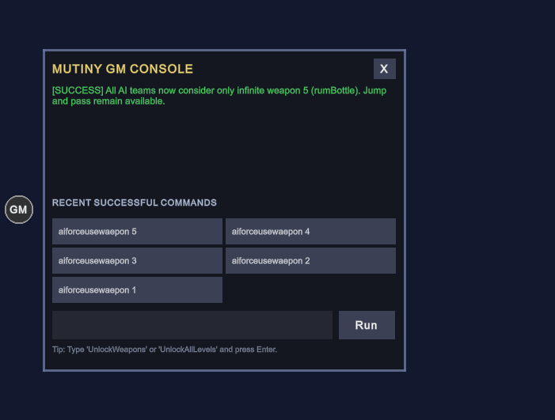

# 11.05 · GM 工具

[返回上级模块](../README.md) · [玩家命令说明](../GM_COMMANDS.md)

当前控制台采用分类 Tab、命令模板按钮和输入框下方的输出区；五条最近成功命令按钮已移除。带参数按钮预填命令词及一个尾随空格，悬停与选中后的详细说明使用中文。新行为规格、别名及本轮验证状态见 [GM 控制台分类与快捷输入](GM_CONSOLE_REDESIGN.md)。下方标明 2026-09-26/27 的历史按钮及 Play Mode 记录仅用于追溯旧基线。

## 定位与证据边界

GM 是当前 Unity 工程的调试扩展，不是 Flash 原版玩法规则。以下规则的“原版来源”均为**不适用**；本页只陈述从当前生产 C# 入口静态核对到的 Unity 行为。历史 Play Mode 结果单独登记，不用现有代码反推原版。核对入口为 [MutinyGMManager.cs](../../../Assets/Mutiny/Scripts/Presentation/MutinyGMManager.cs)、[MutinyCharacter.cs](../../../Assets/Mutiny/Scripts/Simulation/MutinyCharacter.cs)、[MutinyAIController.cs](../../../Assets/Mutiny/Scripts/Simulation/MutinyAIController.cs)、[MutinySaveSystem.cs](../../../Assets/Mutiny/Scripts/Persistence/MutinySaveSystem.cs) 和 [MutinyTurnActionUiVerificationTest.cs](../../../Assets/Mutiny/Scripts/Verification/MutinyTurnActionUiVerificationTest.cs)。

## 生产链路

1. `MutinyGMManager` 在场景加载后自动创建并 `DontDestroyOnLoad`，代码中没有开发构建或战斗场景开关。`OnGUI` 绘制以 550×400 游戏画布为基准的 30 px 按钮，实际尺寸随画布缩放；按钮切换面板开闭，面板 `X` 关闭。
2. 面板通过 `Run` 或输入框聚焦时的 Enter 调用 `SubmitCommand()`。输入被 `Trim()`，空输入直接返回；随后交给公开的 `ExecuteCommand()`。`ExecuteCommand()` 再次去除首尾空格、转为小写匹配，并向 Unity 日志写一条执行记录。命令结果只显示在面板状态文字与颜色中。
3. 命令解析依次检查关卡解锁、关卡重置、AI 单回合接管、AI 强制武器、角色武器解锁、帮助，最后为未知命令。英文大小写不敏感；`Unlock All` 是精确匹配，`UnlockWeapon*` / `InfiniteWeapon*` 是前缀匹配，AI 命令要求恰好两个空白分隔的字段。除 AI 参数解析外，内部空格不会统一折叠。
4. 进度命令调用 `MutinySaveSystem`；角色武器命令调用 `MutinyCharacter.UnlockAllWeapons(true)`；AI 命令调用静态的 `MutinyAIController.TrySetForcedWeaponId()`，由生产 AI 决策和执行路径读取。各路径没有第二套 UI 专用实现。

## 可观察规则与状态转换

### GM-14 · AI 策略开关

用户授权扩展，原版来源不适用。`aienhance 1/0` 选择 effects-v1 增强入口／原兼容入口，默认关闭、跨关卡保留、不写存档。正式 GM 解析、历史重放、安全取消与动作身份的历史验收见 [策略边界规格](../../08-ActionAgents/05-AIWeaponSelection/AI_STRATEGY_BOUNDARY_20260929.md)；现行 [完整效果模拟初版](../../08-ActionAgents/05-AIWeaponSelection/AI_ENHANCED_SIMULATION_V1.md) 不再使用 fallback，包含八枚金币、扇风计划及 HP 评分，同时明确保留随机/组件顺序近似。玩家说明见 [GM-14](../GM_COMMANDS.md#gm-14--ai-策略开关)。

### GM-11 · 可选爆炸击退镜头

原版来源不适用，用户授权扩展。生产 GM 解析支持 `excamera 1` 开启、`excamera` / `excamera 0` 关闭，新增 `blastcam` 易读别名；非法参数不改状态。会话默认关闭、不写存档；跨关卡保留开关，关卡重置清除跟随批次，`SubsystemRegistration` 清零开关。规格及实际验证见 [GM-11 命令说明](../GM_COMMANDS.md#gm-11--爆炸击退运镜) 与 [镜头扩展规则](../../09-PresentationAndFeedback/04-Camera/README.md)。

### GM-09 · 切换语言

原版来源：不适用，用户授权扩展。`lang en` / `lang zh-cn` / `lang zh-hk` 经 `ExecuteCommand` 选择英文/简中/香港繁中，菜单和战斗共用，成功后保存语言；旧 `setlanguage` 是兼容别名。拒绝缺参、旧 `cn`、非法语言及额外参数，原选择保持不变。详细规格和验收见 [GM-09](../GM_COMMANDS.md#gm-09--切换语言) 和 [香港繁体中文](../../09-PresentationAndFeedback/LOCALIZATION_HONG_KONG.md)；旧双语 Play Mode 结果属历史，新命令和三语回切待用户运行验收。

### GM-UI-02 · 最近成功命令（2026-09-26 历史规格，现已移除）

以下为旧版规则，当前由 `GM-UI-02-R` 废止。原版来源：不适用，用户授权的 Unity GM 交互扩展。旧版打开 GM 面板时，在状态区与输入框之间显示最多五个历史按钮，成功执行保留原文本；点击后通过 `ExecuteCommand` 重放。当前版本不再记录或展示这类历史。

验收用例：经正式解析入口依次执行六条有效命令及错误命令，断言只保留最近五次且顺序正确；执行重复命令应保留两次；点击旧历史项后断言实际命令效果、状态文字和新顺序；关闭/打开面板和切场景后仍显示历史，重启后为空；分别在 550×400 与宽屏下核对五个按钮的可见性、文字、悬停、命中区域、焦点及点击时序。实际结果：已实现并通过 C# 编译；2026-09-26 隔离 Unity 6000.6.0f1 Play Mode 的新增 3 条生产入口断言通过；图形模式下 701×531 Game View 截图确认五项文字完整、布局没有相互遮挡。实际鼠标点击/悬停及跨场景/重启仍待验收。

截图由隔离验证启动器经生产 `ExecuteCommand` 输入五条 AI 命令、设置面板为打开状态后在图形模式 Game View 捕获；它验证渲染布局，不作为点击或焦点行为通过证据。第一次无图形批处理截图未生成，改用隐藏的图形模式 Editor 后成功捕获。

下表中的命令 ID 与回归断言的显示文字是两种编号。旧测试把 `GM-02` 至 `GM-06` 用作 GM-01 和按钮的断言标题；命令注册表目前没有 `GM-06`。

| 规则 ID | 输入与前态 → 可观察结果 | Unity 入口 | 验收用例与实际结果 |
| --- | --- | --- | --- |
| `GM-UI-01` | 任意场景点 `GM`：面板开/关；开面板后输入框聚焦；`X` 关闭；`Run` 或聚焦输入框按 Enter 提交；空输入不执行命令。按钮在参考画布为 30 px，随分辨率等比缩放。 | `AutoInitialize`、`OnGUI`、`DrawCommandPanel`、`SubmitCommand` | 完整回归有 2 条按钮矩形断言，已按当前缩放规则更新；未驱动实际点击、聚焦或提交；本轮未运行。 |
| `GM-UI-02`（历史） | 旧版最多五条成功命令按钮；当前由 `GM-UI-02-R` 废止。 | 已移除的 `DrawRecentCommands`、`RunRecentCommand` | 2026-09-26 隔离 Unity Play Mode 的 3 条旧版断言通过；不代表当前分类面板。 |
| `GM-PARSE-01` | 输入先去除首尾空格、英文大小写不敏感；合法命令按固定顺序分支。未知文本显示 `[ERROR]` 和帮助提示。AI 编号缺失、非整数、越界或多余参数显示用法错误，原覆盖保持不变。 | `MutinyGMManager.ExecuteCommand` | GM-07 专项覆盖 3 种非法输入及覆盖不变；一般别名、空输入、未知命令和状态文字待验收。 |
| `GM-01` | `UnlockWeapons` 等单目标别名：按下述优先级找到一名存活角色 → 15 种菜单武器及 `cannonball` 内部别名无限，`CanShoot=true`；如果该角色在当前回合队伍，同步选中。无存活角色显示错误。 | `FindTargetCharacter` → `MutinyCharacter.UnlockAllWeapons(true)` → `MutinyTeam.SelectCharacter` | 旧完整回归有 4 条武器效果断言，但本轮未运行；目标优先级、无目标及立即操作待验收。 |
| `GM-02` | `UnlockWeaponsAllTeam` 等全队别名：遍历场景中所有存活且 `TeamIndex==1` 的角色并执行 GM-01 的武器写入；没有匹配角色时显示成功、计数 0；不更改当前选中角色。 | `MutinyGMManager.ExecuteCommand` 的 `targetAll` 分支 | 当前没有独立生产入口回归，待验收。 |
| `GM-03` | `unlockalllevels` / `unlocklevels` / `UnlockAll` / `Unlock All`：最高已解锁关卡 → `MaxLevel=18`，通过存档层持久化，1..18 全部可进入。 | `ExecuteCommand` → `MutinySaveSystem.HighestUnlockedLevel` | 2026-10-02 GM 82/82 含精确小写命令和易读别名，检查关卡资格与真实存档键；旧版历史按钮重放仅属 2026-09-26 历史结果；重启/实际选关 UI 待验收。 |
| `GM-04` | `ResetLevels` / `ResetProgress` / `LockAll`：删除最高已解锁关卡键，下次读取返回默认值 1；完成分数和音频设置不受影响。 | `ExecuteCommand` → `MutinySaveSystem.ResetProgress` | 当前没有独立 GM 命令回归，待验收。 |
| `GM-05` | `Help` / `?`：状态文字变为命令简表，不修改战斗与存档。简表只列推荐命令，不覆盖所有别名。 | `MutinyGMManager.ExecuteCommand` | 当前没有独立面板文字回归，待验收。 |
| `GM-07` | `aiforceusewaepon 1..15`：全局 AI 武器候选只含对应菜单武器，按无限弹药执行且不扣真实库存；跳跃、Pass 与通常 `CanShoot` 门仍有效。`0` 清除覆盖。非法输入保持原值。 | `ExecuteCommand` → `MutinyAIController.ForcedWeaponId` → 决策候选 → `AIMove.UsesForcedWeaponSupply` → `ExecuteMove` | 2026-09-25 当前工程 Play Mode 专项回归历史结果 7/7；本轮未重新运行。完整战斗画面与“有候选但收益非正”的续行动分支待验收。 |
| `GM-08` | `aitakeover {luck}`，保留 `aitakeoverwithluck` 别名：以指定有限 Luck `0..99999` 接管当前人类回合剩余行动；真实跳跃飞行中/落地后合法，不改角色 Luck 或行动资格；完整回合结束清除覆盖并恢复人类控制。 | `ExecuteCommand` → `TryTakeOverCurrentPlayerTurn(luck)` → `MutinyAIController.TakeoverLuckOverride` → 通常 AI 流程；`RestorePlayerControl` | 旧范围的 35/35 仅属历史；当前结果见 [扩展规格](AI_LUCK_COMMANDS_SPEC.md)。 |
| `GM-12/13` | `aisetluck {luck}` 统一覆盖当前单人关卡敌方 Luck（0..99999）；`airesetluck` 恢复各角色原始默认；双人模式拒绝，重建不继承。 | `ExecuteCommand` → `MutinyLevelController.TrySetCurrentAiLuck` → `LevelLuckOverride` | 规格、生产入口验收及实际结果见 [Luck 扩展](AI_LUCK_COMMANDS_SPEC.md)。 |
| `GM-10` | `ailog 1/0`：开关每次实际 AI 行动的一条详细参数与评分日志；无效参数不改状态，切关保留、重启重置。 | `ExecuteCommand` → `MutinyAIController.ActionLogEnabled` → 生产决策协程的行动／Pass 提交点 | 隔离 Play Mode `RunGM()` 39/39（含 3 条新断言），实际协程 5/5；[范围与剩余项](../04-Logging/AI_ACTION_LOG_SPEC.md)。 |

### 单目标选择顺序

`GM-01` 依次查找：当前队伍已选存活角色、Team 1 已选存活角色、当前队伍首个存活角色、Team 1 首个存活角色、场景中标记为已选的存活角色、场景中首个 Team 1 存活角色、场景中首个任意存活角色。因此在 AI 回合或只有 AI 角色时，单目标命令也可能作用于 AI；命令名称本身不限定玩家队伍。若因此切换当前队伍选中角色，生产 `SelectCharacter` 还会清除该角色的自投掷标记、发送选中事件并请求角色语音；目前 GM 回归未单独覆盖这些间接效果。

### 状态存活期

| 状态 | 写入位置 | 切场景 | 重新开始 Play / 重启游戏 |
| --- | --- | --- | --- |
| GM 面板开闭与文字 | `MutinyGMManager` 常驻实例 | 保留 | 重置 |
| GM-UI-02-R 命令分类与模板 | 同一 `MutinyGMManager` 实例内的选中 Tab、未提交输入和最新输出 | 保留 | 清空，不写入存档 |
| GM-01/02 武器库存与无限标记 | 当前 `MutinyCharacter` 对象 | 对象随场景销毁时消失；新关角色不继承 | 重置 |
| GM-03/04 最高关卡进度 | `MutinySaveSystem` 的 `mutiny_highest_unlocked_level` | 保留 | 保留；除非再次重置 |
| GM-07 强制武器编号 | `MutinyAIController` 静态字段 | 保留 | `SubsystemRegistration` 重置为 0 |
| GM-08 当前人类回合接管及 Luck | `MutinyTurnManager.m_AiTakeoverTeam`、临时队伍 AI 标记、`MutinyAIController.TakeoverLuckOverride` | 管理器销毁即恢复和清空；不转移至新关 | 重置；同一场景完整回合结束、GameOver 或 StartGame 也恢复 |
| GM-10 AI 行动日志开关 | `MutinyAIController.ActionLogEnabled` 静态字段 | 保留 | `SubsystemRegistration` 重置为关闭 |

GM-07 在决策开始时把武器类型复制到工作对象；已选射击动作另存是否使用强制供给。因此在决策或执行途中改变命令，不追溯改写那次动作。GM-01/02 则直接修改角色的 `WeaponInventory`、`InfiniteWeapons` 和 `CanShoot`；`GetAmmunition()` 对无限武器返回 `-1`，底层库存值为 `int.MaxValue`。`cannonball` 是大炮内部库存别名，不占第 16 个菜单编号。

## 待执行验收用例

以下是完整人工验收定义，自动断言和布局截图的已运行范围见下文，未覆盖部分仍待运行。

- `GM-UI-01`：分别在菜单和战斗场景观察按钮可见性；核对常态、悬停、圆形图像、实际矩形按钮命中区与带黑边画布定位；点击打开、关闭，检查焦点时序；分别用 `Run`、聚焦后的 Enter 和空输入提交，检查命令只执行一次。
- `GM-UI-02-R / GM-UI-04..06`：核对面板不再出现历史按钮；分别切换五个 Tab、点击参数模板、检查填入文字及末尾焦点，悬停说明与 Help 一致；检查未自动执行、输入框下方输出、长 Help 滚动及 550×400/宽屏布局。
- `GM-PARSE-01`：从面板输入前后带空格及大小写变化的合法命令、未知命令；逐一提交缺参、额外参数、非整数与越界的 AI 命令，读取面板错误文字并确认 `ForcedWeaponId` 保持原值。
- `GM-01`：用正式 `ExecuteCommand` 在当前队伍已选、仅 Team 1 已选、场景内仅有存活 AI、完全无存活角色等局面执行；检查目标顺序、15 种武器与大炮别名、`CanShoot`、选中事件及无目标错误。
- `GM-02`：构造两个存活 Team 1 角色、一个死亡 Team 1 角色及一个其他队伍角色，执行全队命令；检查仅两名目标改变、原选中角色不变。再于零目标场景执行，核对当前实现的成功计数 0。
- `GM-03/04`：先保存测试前的存档进度与已完成分数，经 GM 生产命令分别解锁和重置；检查当前读取值、切场景与重新启动后的值，并确认已完成分数和音频设置不变；验收后恢复测试前存档。
- `GM-05`：通过面板执行 `Help` 与 `?`，核对显示的推荐命令和无战斗/存档状态修改。
- `GM-07`：沿用专项生产解析与 AI 候选/执行回归；另在真实回合构造“有强制武器候选但评分非正”的续行动和跨场景情形，核对 Pass、库存不扣减、`0` 关闭及重新开始 Play 时清零。

## 验收状态与缺口

### GM-08 · 指定 Luck 的单回合接管（2026-09-27）

原版来源：不适用，用户授权扩展。规格与错误条件见 [命令说明](../GM_COMMANDS.md#gm-08--当前玩家单回合-ai-接管)。生产入口为 `ExecuteCommand` → `TryTakeOverCurrentPlayerTurn(luck)`；不调用 `StartTurn`，已跳跃者保留所选角色及剩余射击资格，飞行中等待正式结算；未提交的玩家瞄准、武器和光标经输入生产清理入口撤销。AI 控制器只在本次接管期间使用 `TakeoverLuckOverride` 计算每种普通武器/Anchor/Cannon 的候选数，原角色 `Luck` 保持不变。完整回合结束、GameOver、重新初始化和销毁时恢复人类控制并清除覆盖。非法 Luck 及重复请求失败；`aitakeover 1` 现在合法且 Luck=1。

- 静态确认与已实现：GM 解析、Help、输入清理、临时 AI 控制、自动恢复及通常两阶段流程已接入；`Assembly-CSharp-Editor` 连同运行时程序集编译通过，3 个原有警告、0 错误。
- 历史实际测试：2026-09-27 旧 `0..100` 规格在隔离 Unity 6000.6.0f1 Play Mode 执行 `RunGM()`，35/35 断言通过，含旧命令拒绝、非法/分数 Luck、`7.5 → 7` 与 `9.25 → 9` 次真实武器候选、跳跃资格、完整结算、原角色 Luck 保持 3、下一轮恢复原采样数、`0/100` 边界及重开/GameOver 清理。详情见 [GM-08 旧范围记录](Artifacts/GM-08-LUCK-20260927.txt)。2026-09-26 旧 `aitakeover 1` 的 24/24 也只属历史。当前扩大范围及关卡覆盖的实际结果见 [扩展规格](AI_LUCK_COMMANDS_SPEC.md)。
- 实际协程通过：2026-09-27 同一隔离工程运行 `GmLuckLiveBatchRunner.Run`，自然驱动 AI、物理与回合 `Update`，2/2 通过：`7.5` 的首次行动自动射击并恢复；真实玩家跳跃飞行中指定 `9.25`，落地后 AI 自动同角色射击并恢复。该场景用强制海啸稳定选择，Luck 采样次数由上面的生产候选专项验证；不是 15 种武器的实战验收。
- 历史实际协程：2026-09-26 旧命令在隔离工程额外运行 `GmTakeoverLiveBatchRunner.Run`，2/2 场景通过；自然驱动了 AI/物理/回合 `Update`，但未使用新语法或验证 Luck 覆盖。旧日志与验证边界见 [GM-08 历史记录](Artifacts/GM-08-20260926.txt)。
- 待运行验证：真实鼠标/触摸提交、双人模式玩家 2 的实际画面、拾取空投现场、15 种武器各自的接管画面；已实现不表示这些场景全部运行过。
- 已知差异：此命令无 Flash 原版对应；当前只接受有限 Luck `0..99999`，不接管未来多个回合，不在已经提交的武器序列中途转换操作者。复用/新增 AI 组件保持在队伍上，恢复后由通常 AI 资格门阻止求值。旧 `0..100` 验证属于历史，扩大范围后当前结果见 [扩展规格](AI_LUCK_COMMANDS_SPEC.md)。

- **静态确认**：上述入口、匹配顺序、写入位置和状态存活期均已按当前 C# 核对；原版来源不适用。
- **已实现**：GM-UI-01、GM-UI-02-R、GM-UI-04..06、GM-UI-04-A/05-A、GM-PARSE-01/02 及各现有 GM 命令的生产路径存在；旧 GM-UI-02 历史入口已移除。2026-10-02 当前 `Assembly-CSharp-Editor.csproj` 连同运行时程序集编译通过（12 个现有警告，0 错误）。
- **实际测试通过**：2026-10-02 独立工程 Unity 6000.6.0f1 Play Mode：GM **82/82**、关卡入口 **68/68**，连同资源、双人、镜头初始化与结局总计 **236/236**；范围见 [本次 GM 控制台记录](Artifacts/GM-CONSOLE-TEMPLATES-ZH-20261002.txt)。测试覆盖简写的正式解析、实际状态、全部参数模板的尾随空格、14 条中文说明、随包中文字体及 Help 共源；不证明真实图形点击。原先的 [235/235 记录](Artifacts/GM-CONSOLE-20261002.txt)与 2026-09-27 的 `35/35`、2026-09-26 的 `12/12`、`24/24` 和旧五按钮截图只属历史基线。
- **待运行验证**：GM-UI-04..06 及 GM-UI-04-A/05-A 的鼠标悬停、按钮命中区域、键盘焦点、实际点击、输入框空格保留、中文说明的实际字形、输出滚动与时序，以及触摸说明；GM-01 的目标优先级及错误分支；GM-02 的人数和全队边界；GM-03 的重启及实际选关 UI、GM-04 的完整存档流程；GM-07 在完整回合及非正收益续行动中的表现。
- **已知差异与边界**：GM 系列整体为 Unity 扩展，不能计入 Flash 原版一致性。按钮视觉为圆形，`GUI.Button` 的命中区为矩形；GM-02 在零目标时仍显示成功；武器前缀匹配会接受任意后缀；公开 `ExecuteCommand(null)` 没有空值保护，正常 UI 提交路径不会传入 null。以上是当前行为，后续如决定调整，须先固定规格并补能检出缺陷的生产入口用例。

## 维护入口

GM-15 `enterlevel` 与模式编号的规格及本轮验证见 [关卡身份与直达](../../02-LevelAndWorld/01-LevelDataParsing/LEVEL_IDENTITY_AND_GM_ENTRY.md)。新增非法参数解析检查接入 `RunGM`，完整生产加载回归入口为 `Mutiny → Parity → Validate Level Identity and GM Entry Play Mode`（空场景）。

当前运行结果：[GM-08 指定 Luck 验证（2026-09-27）](Artifacts/GM-08-LUCK-20260927.txt)。旧 [GM 专项 12 条断言结果（2026-09-26）](Artifacts/GM-12Assertions-20260926.txt) 保留为历史；测试恢复原进度，不替用户实际解锁主工程存档。

修改命令时同步核对 [玩家命令说明](../GM_COMMANDS.md)、`MutinyGMManager` 中共用的命令定义和生产解析，以及 [GM 回归](../../../Assets/Mutiny/Scripts/Verification/MutinyTurnActionUiVerificationTest.cs)。专项菜单 `Mutiny → Parity → Validate GM Commands` 见 [MutinyParityValidationMenu.cs](../../../Assets/Mutiny/Scripts/Verification/Editor/MutinyParityValidationMenu.cs)。新增命令先分配稳定 ID，写明输入、目标、前后态、持久化范围、错误行为、原版来源（扩展写不适用）、生产入口及实际验收结果；不得沿用旧断言标题充当命令 ID。
