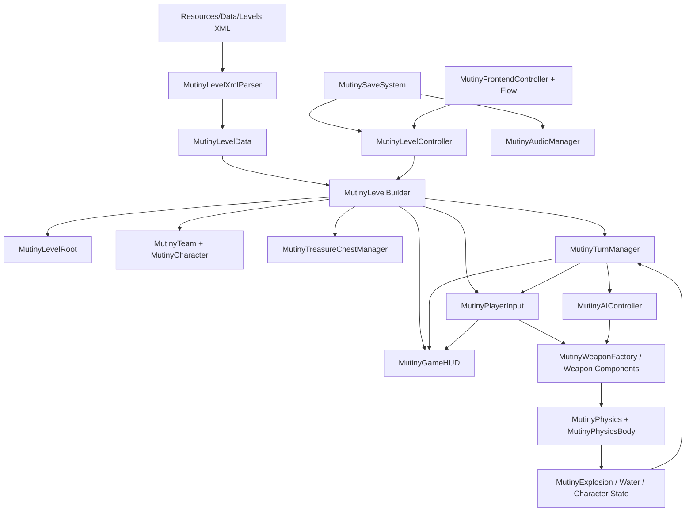

# Mutiny X

Mutiny X 是一个使用 **Unity 6** 重构 Nitrome Flash 游戏《Mutiny》的项目。项目不是按“看起来像原版”进行近似重写，而是以原始 SWF、AS2 反编译结果、pcode、时间轴、关卡 XML、导出资源和原版运行表现为证据，逐步把 Flash 的规则、状态机、画面、声音与操作语义迁移到 Unity。

> **当前状态（2026-09-18）**：已经具备可运行的单人游戏闭环，包括关卡生成、25 Hz 自定义模拟、角色与队伍、15 种战术武器、AI、空投、HUD、音频、存档和单人前端流程；18 个本地关卡 XML 已进入运行时与回归体系。与此同时，项目仍在持续进行 **Original Parity（原版一致性）审计**，因此“功能存在”不等于“已经与 Flash 原版逐帧/逐行为完全一致”。

## 项目概况

| 项目 | 当前基线 |
| --- | --- |
| Unity | `6000.6.0f1` |
| 渲染 | URP / 2D |
| 原版舞台 | 550 × 400，25 FPS |
| 地图网格 | 32 px / tile，Unity 中 32 PPU、1 tile = 1 unit |
| 关卡数据 | `level_01.xml` ~ `level_18.xml`，均为单人 XML |
| 当前单人前端 | 标题页 → 人数选择 → 单人选关 → Gameplay；选关 UI 当前按原版流程显示 15 格 |
| 战术武器 | 15 种菜单武器；`cannonball` 为 Cannon 的内部弹药/对象，不算第 16 种 |
| 模拟 | 自定义 25 Hz 离散物理，不依赖 Rigidbody2D 作为核心玩法模拟 |
| 原版脚本逆向 | source / deobfuscated / pcode 各 494 份脚本 |
| 原版类索引 | 99 个 AS2 类、688 个方法/访问器、932 个字段声明 |
| 原版美术导出 | 7417 PNG、6618 SVG，含时间轴、帧标签、注册点与嵌套放置索引 |

原始 SWF 基线：

```text
c034d2cfa50272a1aac93ad75114b542ca5993dd7b70fa8901aa195de7820586
```

## 当前完成度怎么理解

项目早期的 01~18 开发里程碑已经完成，意味着主要系统已经进入可运行/可验证状态；但现在采用更严格的原版一致性标准，因此不能把这些里程碑直接解释为“整个游戏已经 100% 复刻”。

### 已实现并进入自动验证体系

- 18 关 XML parser、批量扫描、运行时资源加载与关卡生成。
- 107 种关卡 tile 标记的映射；背景、实体地形、水域与逻辑标记分层。
- 角色、队伍、生命值、武器库存、选择与行动资格。
- 25 Hz 离散移动、重力、碰撞、反弹、摩擦、落水、爆炸、伤害与击退。
- 回合状态机、静止结算、队伍轮换、胜负判断与单人计分。
- 15 种战术武器及各自的 C# 生产组件。
- 单人 AI 决策、瞄准与行动执行。
- Treasure Chest / Air Drop 生成、掉落池、下落、拾取和镜头跟随基础流程。
- 游戏内 HUD、行动面板、武器槽、角落控制、结束弹窗、位图字体。
- 菜单音乐、游戏音乐、SFX，以及音量/开关持久化。
- 关卡解锁存档与单人流程状态。
- GM 调试命令与对应生产回归入口。

### 仍在持续做原版一致性审计

当前详细工作不再以“有没有同名类”为完成标准，而是检查：前置状态、输入、状态转换、25 Hz 时序、资源帧、命中区域、音效、镜头和最终可观察表现是否与原版一致。近期审计范围包括行动 UI、角色时间轴/层级、旋转动画、空投、战斗 HUD、结束弹窗、角落按钮和每一种特殊武器。

### 当前明确的范围差异

- `MutinyFrontendController` 的单人选关流程当前按原版前端规格使用 **15 个选关位**，而运行时 `MutinyLevelController` / `MutinySaveSystem` 和本地数据支持 **18 个 XML 关卡**。这个范围差异不能被 README 隐藏，后续按原版证据继续处理。
- Scores / Help / Credits / 2 Player 当前主要保留显示与 hover；现有生产前端的完整可玩路径是单人流程。
- 静态反编译、美术导出和自动断言只能证明各自范围，不能单独证明完整的原版运行时画面和节奏一致。

## 运行架构



关卡不是手工堆在场景里的固定对象集合。`MutinyLevelController` 读取运行时 XML，交给 `MutinyLevelXmlParser` 生成数据模型，再由 `MutinyLevelBuilder` 构造背景、地形、水域、角色、队伍、空投管理器、回合控制器、输入和 HUD。玩法层随后由 `MutinyTurnManager` 协调玩家输入或 AI 与武器/物理系统。

## 代码目录

```text
Assets/
├─ Scenes/
│  └─ Main.unity
└─ Mutiny/
   ├─ Resources/
   │  ├─ Art/                  # 运行时角色、tile、武器、特效等
   │  ├─ Audio/                # Music / SFX
   │  ├─ Data/Levels/          # 运行时 level_01 ~ level_18
   │  └─ UI/                   # Frontend、HUD、字体、按钮状态资源
   └─ Scripts/
      ├─ Level/                # XML、数据模型、关卡构建与控制
      ├─ Simulation/           # 物理、角色、队伍、回合、AI、武器、空投
      ├─ Presentation/         # 输入、HUD、前端、镜头、音频、位图字体、GM
      ├─ Persistence/          # PlayerPrefs 存档封装
      └─ Verification/         # 生产路径验证与回归测试

Docs/
├─ LevelScan/                  # 18 关扫描统计
├─ Modules/                    # 物理、武器、回合系统的说明页面
├─ OriginalParity/             # 当前最重要的原版一致性工作区
├─ ReverseEngineering/         # SWF / AS2 / Art / Tiles 等逆向产物
├─ Verification/               # Level 1 与全关卡回归记录
├─ GM_COMMANDS.md
└─ ART_PIVOT_AND_OFFSET_BUGS.md

Tools/ReverseEngineering/      # 可重复的反编译、索引、导出与映射脚本
Mutiny Source/                 # 原版 SWF 与原始关卡材料
```

## 关键模块

| 模块 | 主要入口 | 作用 |
| --- | --- | --- |
| 关卡数据 | `MutinyLevelXmlParser`, `MutinyLevelData` | 解析原版 XML/RLE，保留 `[y,x]` 数据与对象原始属性 |
| 关卡构建 | `MutinyLevelController`, `MutinyLevelBuilder`, `MutinyLevelRoot` | 从 XML 动态构建背景、碰撞地形、水域、角色和运行时系统 |
| 角色与队伍 | `MutinyCharacter`, `MutinyCharacterAnimator`, `MutinyTeam` | 生命、库存、行动资格、动画与队伍状态 |
| 物理 | `MutinyPhysics`, `MutinyPhysicsBody` | 以像素/tick 表达的 25 Hz 离散运动与逐轴碰撞 |
| 回合 | `MutinyTurnManager` | `NotStarted → TurnActive → ActionExecuting → Settling → GameOver` |
| 玩家操作 | `MutinyPlayerInput`, `MutinyTrajectoryRenderer`, `MutinySpecialWeaponCursor` | 选人、拖拽瞄准、预测、特殊武器输入与行动提交 |
| 武器 | `MutinyWeapon`, `MutinyWeaponFactory` + 各独立武器类 | 武器生命周期、发射/放置/特殊控制、库存与结算 |
| AI | `MutinyAIController` | 等待合法行动窗口、评估动作、选人/选武器/瞄准并走生产入口执行 |
| 空投 | `MutinyTreasureChestManager`, `MutinyTreasureChest` | 权重池、有效列、下落、拾取、奖励与回合影响 |
| HUD / 菜单 | `MutinyGameHUD`, `MutinyFrontendController`, `MutinyFrontendFlow` | 550×400 原版风格 UI、选关、行动面板、结束弹窗 |
| 镜头 | `MutinyCameraController` | 地图滚动与角色、武器、空投等目标跟随 |
| 音频 | `MutinyAudioManager` | `Resources/Audio` 加载、音乐/SFX、静音与音量状态 |
| 存档 | `MutinySaveSystem` | 关卡解锁、音乐/SFX 设置的 PlayerPrefs 封装 |
| GM | `MutinyGMManager` | 调试命令；属于 Unity 扩展，不属于 Flash 原版行为 |
| 验证 | `MutinyLevel1VerificationTest`, `MutinyAllLevelsRegressionTest`, `MutinyTurnActionUiVerificationTest` | 从生产代码入口检查关卡、回合、UI、资源与行为回归 |

## 核心实现说明

### 1. 25 Hz 离散模拟

原版 Flash 逻辑以 25 FPS / tick 推进。Mutiny X 没有直接把核心玩法交给 Unity Rigidbody2D，而是把原版常量和更新顺序迁移到 `MutinyPhysics` / `MutinyPhysicsBody`。常用量仍以 **px/tick** 表达，例如角色 weight、地面摩擦、墙体反弹和 twang 发射速度，再由 32 PPU 映射到 Unity 世界。

这样做的目标是保证：同一逻辑输入在不同渲染帧率下仍得到一致的游戏模拟结果，并能逐 tick 与 AS2/pcode 对照。

### 2. 地图与坐标

- XML 数组保持原版 `[y, x]`。
- 32 px = 1 tile = 1 Unity unit。
- XML 从左上向下增长；Unity 构建时使用负 Y 映射。
- `row` 生成实体地形；`bgRow` 是视觉背景。
- `antichest` 是用于空投有效列判断的逻辑/背景标记，不作为普通可见 tile 强行生成。
- 地形按现有逆向结论不可破坏；爆炸作用于角色/对象，不挖掉 tile。

### 3. 回合与行动资格

`MutinyTurnManager` 使用明确的生产状态机，而不是用 UI 状态推断回合是否结束。全场动作完成后需要连续的 25 Hz 静止 tick 才进入下一步结算。

当前通用人类回合规则已经区分角色 Throw Self 与武器行动：跳跃后仍可继续使用合法武器；提交武器后会结束该角色本回合的攻击链。特殊武器是否覆盖通用规则，必须按各自原版类与规格单独验证。

### 4. 武器系统

当前菜单武器集合：

```text
cherryBomb, boulder, dynamite, piecesOfEight, rumBottle,
banana, parachuteBomb, woodenCrate, gunpowderBarrel, seagull,
mine, cannon, anchor, voodooDoll, tidalWave
```

每个复杂武器都有独立生产组件，不以一个“通用抛射物 + 不同伤害”代替所有行为。Cannon 使用 `cannonball` 作为内部对象/库存别名。

针对武器的新增或修复必须遵循 [`Docs/OriginalParity/Specs/WEAPON_REPLICATION_WORKFLOW.md`](Docs/OriginalParity/Specs/WEAPON_REPLICATION_WORKFLOW.md)：先追踪原版类、父类、调用者、物理、资源、声音和回合依赖，再写状态转换和回归用例。

### 5. AI

`MutinyAIController` 只在当前 AI 队伍拥有合法 `TurnActive` 窗口时执行。它会等待场景/镜头准备，评估候选动作并通过与玩家一致的生产系统提交动作，而不是直接修改最终结果。AI 的具体决策流程记录在 [`AI_DECISION_FLOW.md`](Docs/OriginalParity/Specs/AI_DECISION_FLOW.md)。

### 6. UI 与 Flash 时间轴语义

UI 不是简单换成 Unity 默认 Button。项目保留 550×400 的逻辑视口，并从 SWF 中恢复：

- 位图字体 normal / hover 字形。
- `up / over / disabled` 等按钮时间轴状态。
- 武器槽、跳跃、End Turn、角落控制的原版帧资源。
- Flash 注册点、shape bounds 和嵌套 MovieClip 的位置信息。

如果一个原版子 MovieClip 可以独立 `gotoAndStop()`，Unity 侧也应保留它独立的视觉状态，而不是只画一张父面板 PNG。

### 7. 音频与存档

`MutinyAudioManager` 从 `Resources/Audio/SFX` 和 `Resources/Audio/Music` 加载资源并保存开关/音量；`MutinySaveSystem` 保存最高解锁关卡和音频设置。单人关卡分数是当前单人会话状态，不等同于长期解锁存档。

### 8. GM 调试扩展

游戏内 GM 面板是 Unity 版的调试扩展，不属于原版一致性结论。当前支持解锁武器、全队无限武器、解锁/重置关卡与 Help。完整命令和持久化影响见 [`Docs/GM_COMMANDS.md`](Docs/GM_COMMANDS.md)。

## SWF 逆向资料

原始输入位于：

```text
Mutiny Source/mutiny-flash-game/mutiny.swf
```

主要逆向产物位于：

```text
Docs/ReverseEngineering/Swf/
├─ source/scripts/             # 默认 AS 反编译，对照混淆/异常
├─ deobfuscated/scripts/       # 自动去混淆，日常优先阅读
├─ pcode/scripts/              # AVM1 字节码反汇编，语义争议时回查
├─ mutiny.swf.xml              # 完整 SWF tag / timeline / script byte 数据
├─ symbols/
└─ ...

Docs/ReverseEngineering/AS2/   # 类树、方法、字段、引用、事件、game-flow
Docs/ReverseEngineering/Art/   # PNG/SVG、frame labels、placements、origins、bounds
Docs/ReverseEngineering/Tiles/ # XML tile → SWF symbol → Unity resource 映射
```

反编译出的 `.as` **不是开发者原始源码的逐字恢复**：注释、部分局部变量名、原始工程组织和未编译内容已经丢失。日常分析优先看 `deobfuscated`，涉及可疑条件、循环或反编译异常时必须回查 `pcode`，视觉问题还要结合 SWF 时间轴和原版运行结果。

可重复生成命令包括：

```powershell
python Tools/ReverseEngineering/decompile_swf.py
python Tools/ReverseEngineering/build_class_index.py
python Tools/ReverseEngineering/export_art.py
```

详细工具版本、命令、指纹和限制见 [`Docs/ReverseEngineering/Swf/README.md`](Docs/ReverseEngineering/Swf/README.md) 与 [`Docs/ReverseEngineering/Art/README.md`](Docs/ReverseEngineering/Art/README.md)。

## 原版一致性工作流

原版行为的当前权威工作区是 [`Docs/OriginalParity`](Docs/OriginalParity/README.md)。核心原则：

1. 先找原版证据，再修改 Unity；不能从当前 C# 反推“原版应该如此”。
2. AS2 反编译有歧义时回查 pcode。
3. 视觉必须同时检查 symbol、帧标签、注册点、嵌套层级和运行时表现。
4. 每条行为区分“证据状态 / 实现状态 / 验证状态”。
5. 编译通过、资源存在、写了测试步骤，都不能单独等价为玩法一致。
6. 缺陷修复应补能在修复前暴露问题、修复后通过的生产路径回归。

完整标准见 [`REPLICATION_STANDARD.md`](Docs/OriginalParity/REPLICATION_STANDARD.md)，具体行为规格位于 [`Docs/OriginalParity/Specs`](Docs/OriginalParity/Specs)。

## 验证与回归

现有验证资料包括：

- [`Docs/Verification/level-1-comparison.md`](Docs/Verification/level-1-comparison.md)：Level 1 数据、队伍、核心物理、伤害和回合断言记录。
- [`Docs/Verification/full-level-regression.md`](Docs/Verification/full-level-regression.md)：18 个 XML 关卡的数据/队伍/水域/AI/解锁链路回归。
- [`Docs/OriginalParity/VALIDATION.md`](Docs/OriginalParity/VALIDATION.md)：当前一致性验证结果、待 Play Mode / 原版运行对照项。

Unity 中的主要验证入口：

```text
Mutiny → Levels → Scan All XML
Mutiny → Parity → Validate Runtime Resources
Mutiny → Parity → Validate Turn Action UI
```

代码编译检查通常使用：

```powershell
dotnet build Assembly-CSharp.csproj --no-restore
```

> `Docs/Verification` 中早期报告的“PASS / 100%”只表示报告所列断言范围通过。项目当前以 `Docs/OriginalParity/REPLICATION_STANDARD.md` 的更严格标准判断“是否完成原版复刻”。

## 开发环境与启动

1. 使用 Unity Hub 以 **Unity 6000.6.0f1** 打开仓库根目录。
2. 等待 Package Manager 与脚本编译完成，确认 Console 没有新的编译错误。
3. 打开 `Assets/Scenes/Main.unity`。
4. 进入 Play Mode，从当前单人前端流程开始测试。
5. 修改玩法前先查对应的 `Docs/OriginalParity/Specs/*.md`；修改原版规则时同时更新证据和回归。

主要 Unity package 版本以 `Packages/manifest.json` 为准；项目使用 URP 17.6、Input System 1.20、2D Animation 16、Pixel Perfect 6、UGUI 2.6 等 Unity 6 包。

## 文档入口

| 文档 | 用途 |
| --- | --- |
| [`TODO.md`](TODO.md) | 历史开发里程碑与持续记录 |
| [`Docs/OriginalParity/README.md`](Docs/OriginalParity/README.md) | 当前原版一致性审计入口 |
| [`Docs/OriginalParity/TODO.md`](Docs/OriginalParity/TODO.md) | 一致性工作的执行清单 |
| [`Docs/OriginalParity/REPLICATION_STANDARD.md`](Docs/OriginalParity/REPLICATION_STANDARD.md) | Flash → Unity 复刻标准和完成门槛 |
| [`Docs/OriginalParity/Specs`](Docs/OriginalParity/Specs) | 回合、UI、角色、武器、空投、HUD 等行为规格 |
| [`Docs/ReverseEngineering/Swf/README.md`](Docs/ReverseEngineering/Swf/README.md) | SWF 反编译产物与复现方式 |
| [`Docs/ReverseEngineering/AS2/README.md`](Docs/ReverseEngineering/AS2/README.md) | AS2 类树、方法、引用与 game-flow |
| [`Docs/ReverseEngineering/Art/README.md`](Docs/ReverseEngineering/Art/README.md) | 美术时间轴、注册点和导出清单 |
| [`Docs/LevelScan/README.md`](Docs/LevelScan/README.md) | 18 关 XML 扫描结果 |
| [`Docs/Verification`](Docs/Verification) | 关卡与核心系统回归报告 |
| [`Docs/Modules`](Docs/Modules) | 物理、武器、回合模块说明 |
| [`Docs/GM_COMMANDS.md`](Docs/GM_COMMANDS.md) | GM 调试命令 |
| [`Docs/ART_PIVOT_AND_OFFSET_BUGS.md`](Docs/ART_PIVOT_AND_OFFSET_BUGS.md) | Flash 注册点 / Unity 偏移类问题记录 |

## 维护约定

- README 描述 **当前可运行架构与入口**，不要再写成一次性的早期开发计划。
- `Docs/OriginalParity/TODO.md` 是当前一致性工作的执行队列；Specs 保存详细规则和证据。
- 修改核心规则时同步更新对应规格、验证和必要的 TODO/审计记录。
- 不因为存在同名 C# 类、资源已导入或编译成功就宣布某功能“与原版一致”。
- 原版资源转换时保留来源 symbol、帧、注册点、矩阵或可追溯映射。

## 原版资源与版权说明

本项目中的原版代码线索、图像、声音、关卡和游戏设计来源于 Nitrome 的《Mutiny》材料。此仓库的逆向、索引和重构文档用于技术研究与复刻开发；仓库内容本身不表示已经取得原作资源的商业使用、再发布或其他授权。
